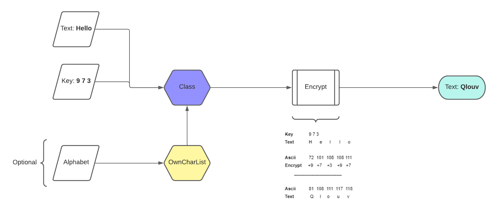

# Encrypt.js v2 [](https://opensource.org/licenses/Apache-2.0)


This is an extended version of [https://github.com/ZhengLinLei/encrypt-charcode-num](https://github.com/ZhengLinLei/encrypt-charcode-num) repository, please read the basic documentation before using this repo and check the new functionalities that have been added in this version.

## How it does work?

Inputs needed
1. Key [ Arr(Int) | Str ]
2. Text [ Str | Int ]
3. Alphabet [ Arr(Str) ] (Optional)





# Javascript use

File script `script.js`. You can add it by `html` or with `node`
```html
<script src="./src/script.js"></script>
```

If you are going to use `node`, please remove the comment from the main script file, in the last line.

## Table of content

1. [KeyStr()](#keystr)
    * [Change key](#change-key)
    * [Encrypt content](#encrypt)
    * [Dencrypt content](#dencrypt)
    * [Import charcode list](#importlist)
    * [Examples of code](#example)
2. [OwnCharList()](#ownchar)
    * [Parameters](#param)
    * [Create own list](#ownlist)
3. [Examples](#code)

## 1. <a name="keystr"></a> new KeyStr(:key, :str)

First need to init a variable
```javascript
let ClassChar = new KeyStr([...])
```

The class need two parameters.
1. Key [Str]
2. Split [Str] : Default = ','
```javascript
let ClassChar = new KeyStr('10|30|11', '|') // SPLIT THE TEXT WITH '|'
```

### 1.1. <a name="change-key"></a> Change key

If you want to change the key, you can do it with `changeKey()` method.
```javascript
let ClassChar = new KeyStr('10|30|11', '|') // SPLIT THE TEXT WITH '|'

ClassChar.changeKey('2,8', ',') // THIS MUST CHANGE THE KEY FROM [10, 30, 11] TO [2, 8]
```

### 1.2. <a name="encrypt"></a> Encrypt content

The `encryptStr()` method help you to encrypt the text, there a two ways to encrypt. One by temporal key or with the key that was initialized.
```javascript
let ClassChar = new KeyStr('10|30|11', '|') // SPLIT THE TEXT WITH '|'

ClassChar.changeKey('2,8', ',') // THIS MUST CHANGE THE KEY FROM [10, 30, 11] TO [2, 8]
// IN THIS CASES WILL USE THE KEY INIALIZATED BEFORE
// key = [2, 8]

console.log(ClassChar.encryptStr('Hello'))
// Return: Jmntq

// ====================================

// OR YOU CAN USE THE TEMPORAL KEY
// THE SYNTAX MUST BE
// [str, split]

console.log(ClassChar.encryptStr('Hello', ['8|3|1', '|']))
// Return: Phmtr

```

### 1.2. <a name="dencrypt"></a> Dencrypt content

And if you want to dencrypt you can do it with `dencryptStr()` method, there a two ways to encrypt. One by temporal key or with the key that was initialized.
```javascript
let ClassChar = new KeyStr('10|30|11', '|') // SPLIT THE TEXT WITH '|'

ClassChar.changeKey('2,8', ',') // THIS MUST CHANGE THE KEY FROM [10, 30, 11] TO [2, 8]
// IN THIS CASES WILL USE THE KEY INIALIZATED BEFORE
// key = [2, 8]

console.log(ClassChar.dencryptStr('Jmntq'))
// Return: Hello

// ====================================

// OR YOU CAN USE THE TEMPORAL KEY
// THE SYNTAX MUST BE
// [str, split]

console.log(ClassChar.dencryptStr('Phmtr', ['8|3|1', '|']))
// Return: Hello

```

### 1.4. <a name="importlist"></a> Import charcode list

If you want to use another charcode list apart from the default (utf-7) ASCII list or your own list, jump to the [OwnCharList()](#ownchar) section and then continue reading this part.

```javascript
let CharVar = new KeyStr('1,3,4');

// Let's create a different charcode list
let AlphabetA = new OwnCharList('utf-16'); // UTF-16

// Import the Alphabet
CharVar.importCharList(AlphabetA);
console.log(CharVar.encryptStr('Hello world!'));
// Ihpmr$xrvmg%
console.log(CharVar.dencryptStr('Ihpmr$xrvmg%'));
// Hello world!


// Now let's create an own charcode list
let AlphabetB = new OwnCharList('own'); // Own list
let ownlist = ['b', 'a', 'c', 'd', 'f', 'e', 'g', 'l', 'w', 'h', 'j', 's', 'i', 'o', 'r', ' '];
AlphabetB.createList(ownlist);

CharVar.importCharList(AlphabetB);
console.log(CharVar.encryptStr('world', ['4 5 3', ' ']));
// icasw
console.log(CharVar.dencryptStr('icasw', ['4 5 3', ' ']));
// world
```


### 1.5. <a name="example"></a> Examples of code

```javascript
let CharVar = new KeyStr('0')

console.log(CharVar.encryptStr('Hello world!', ['20 10 30', ' ']))
// \oŠ€y>‹y€n?

console.log(CharVar.dencryptStr('\oŠ€y>‹y€n?', ['20 10 30', ' ']))
// Hello world!
```

## 2. <a name="ownchar"></a> new OwnCharList(:type)

```javascript
let Alphabet = new OwnCharList([...]);
```

### 2.1. <a name="param"></a> Parameters

The paramateres allowed are
```js
/* ===========
        type: ['utf-7', 'utf-8', 'utf-16', 'utf-32', 'own']

        Default: 'utf-7'
============= */

let AlphabetA = new OwnCharList('utf-32');


// And the own charlist
let AlphabetB = new OwnCharList('own');
// After declared the variable, create the list
```

### 2.2. <a name="ownlist"></a> Create Own List

```js
// And the own charlist
let AlphabetB = new OwnCharList('own');
// After declared the variable, create the list

let charlist = 'asdfghjklqwertyuiopzxcvbnm'.split('');
AlphabetB.createList(charlist);


// Import the Alphabet to Encrypter
let Encode = new KeyStr([0, 2, 1]);
Encode.importCharList(AlphabetB);
```


## 3. <a name="code"></a> Example
```js
let CharVar = new KeyStr('0');

// let Chacode = new OwnCharList('utf-8');

let ownlist = 'abcde'.split('');
// let ownlist = ['b', 'a', 'c', 'd', 'f', 'e', 'g', 'l', 'w', 'h', 'j', 's', 'i', 'o', 'r', ' '];
let Charcode = new OwnCharList('own');
Charcode.createList(ownlist);

CharVar.importCharList(Charcode);

console.log(CharVar.encryptStr('e', ['13 8', ' ']));
console.log(CharVar.dencryptStr('c', ['13 8', ' ']), CharVar.charList.range);
```

<br><br><br>

# Fix some bugs

If you are using terminal to debugging, in some cases the text doesn't be displayed correctly, like `Š€` or some other characters.

### How to fix it?

Use your browser console for debugging, and will display some characters were in terminal doesn't be displayed.


<br><br><br>

### Love this repo? Give us a star ⭐

<a href="./">
  
</a>